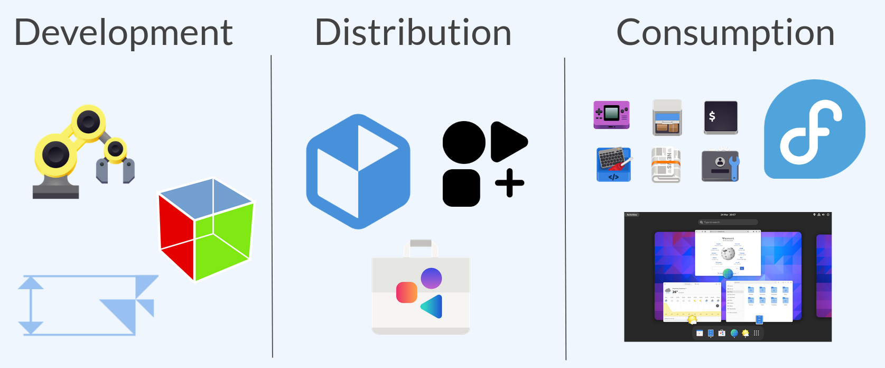
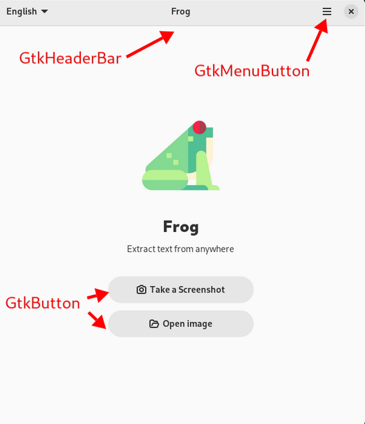
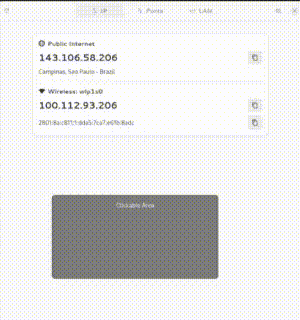
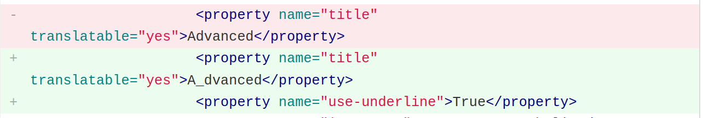
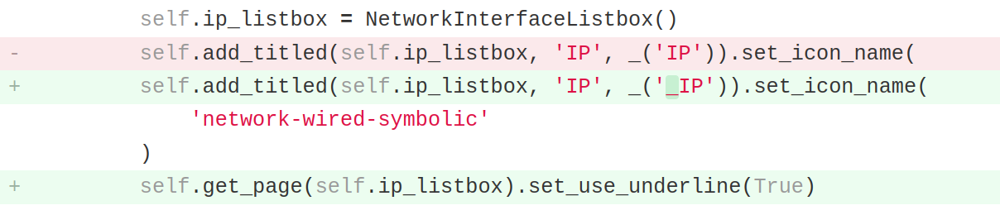
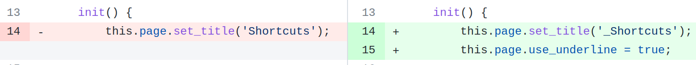
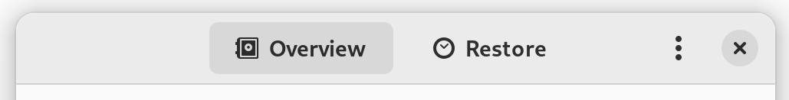

The 1<sup>st</sup> Contribution Hackathon was created by LKCAMP, the Free and Open Source Software study group of the *Universidade Estadual de Campinas* (Unicamp) that I have been a member of for years. Over time, we have made many iterations of this event in our university and even took it to the GUADEC (GNOME's global conference) in 2023.

That being said, thank you for coming to this edition of the 1<sup>st</sup> Contribution Hackathon! We welcome you into our history. Now, buckle up!

# Resources

You can access a page with links to all the resources you'll need to participate in this event by clicking [here](https://lkcamp.gitlab.io/lynx/first-contribution/). Open it and pin that tab in web browser for the entire duration of the event!

# Setup

There are three components that we need for making the contribution: flatpak, flathub, and GNOME Builder. Here's how to get each of them:

## Flatpak

Flatpak is a packaging format for graphical applications that works on any GNU/Linux distribution. It is the most widely embraced packaging format for GNOME applications. To get flatpak on your distro of choice, run:

- **Ubuntu**:

```bash
  sudo apt install flatpak
```

- **Arch**:

```bash
  sudo pacman -S flatpak
```

- **Fedora**: 

```bash
  # already installed
```

## Flathub

Flathub is an app store for the flatpak packaging format. It's one of the biggest software catalogs in the Linux world! You can get it on your computer by running:

```bash
flatpak remote-add --user --if-not-exists flathub \
        https://flathub.org/repo/flathub.flatpakrepo
```

## GNOME Builder

Finally, GNOME Builder is an integrated development environment (IDE) for developing applications in the GNOME ecosystem. Install it with:

```bash
flatpak install org.gnome.Builder
```

And you're all set!

# What is GNOME?

GNOME is a software platform. That means GNOME provides an integrated stack for software development, distribution, and consumption.



An important part of this ecosystem are the GNOME apps, to which we'll contribute in this event! These apps are built with GTK, using GNOME Human Interface Guidelines (HIG).

# What is GTK?

GTK is a fundamental building block for the applications that belong in the GNOME software platform. In programmer's lingo, GTK is an object oriented widgets-based framework for developing graphical applications. Now let's break that down in plain English:

- **Object oriented**:

Object Oriented Programming is a programming paradigm that seeks to improve code organization, reduce code duplication, among many other things. Object Oriented Programming is very "concept heavy", so teaching everything about it is out of scope for this event. Still, we hope to spark your curiosity enough for you to look it up on your own later :)

- **Widgets-based**:

In GTK, every graphical element is a "widget". These widgets are organized hierarchically, for example `Window → Header bar → Menu button`. Here are some of the widgets and their names, in the wonderful [Frog](https://flathub.org/apps/com.github.tenderowl.frog) application:



Widgets' behavior and appearance can be configured with a programming language (C, Python, Rust, JavaScript, Vala, etc) and/or a markup language (XML, Blueprint, etc).

- **Graphical applications**:

Graphical applications are applications that show a window to the user. Some applications are not graphical, for example, that ones that run directly on the terminal.

# Access Keys

## What?

GTK has a feature called Access Keys (also known as "mnemonics"). Here's how it works:

- Hold the `Alt` key until some characters are underlined
- Press an underlined characters while you hold `Alt`
- The action associated with that widget will be triggered



## Why?

Access Keys are an important for two use cases:

- Offering a keyboard-centric workflow for power users
- Improving the accessibility of the GNU/Linux desktop

## How?

To implement an Access Key for a widget within a application, you need to prepend an *underline* (`_`) to whichever character you want to highlighted when the user hold the `Alt` key. For example, to highlight the `C` in button whose label is `"Continue"`, go with `"_Continue"`.

Then, activate the Access Key feature for that widget. To do that you need to set the property "`user-underline`" to `True`.

This can sometimes be done with programming or markup languages. For programming languages, you'll find some examples in the [official documentation](https://developer.gnome.org/documentation/tutorials/beginners/components/label.html?highlight=mnemonics). Luckly for you, we have also made some additional examples, which you can checkout in the [Projects Sheet](https://docs.google.com/spreadsheets/d/1C0J81CPDu1bBct5V49KLvL8jAIPwv_AbCIFr2yiHCQI/edit#gid=0). Here are some highlights:


### Example in XML

Contribution by Gustavo Pechta to the app "Komikku" ([link](https://gitlab.com/valos/Komikku/-/merge_requests/180/diffs#83c420f8542fe5bed57cdd7f5ac8234e05dce352)).



### Example in Python

Contribution by Tárik Sá to the app "What IP" ([link](https://gitlab.gnome.org/GabMus/whatip/-/merge_requests/35/diffs)).



### Example in Javascript

Contribution by Pedro Sader Azevedo to the extension "Space Bar" ([link](https://github.com/christopher-l/space-bar/pull/3/commits/6527e5942de5997e573f8bf9ae5cf976c89415df)).



### GNOME Human Interface Guidelines

Now you might asking yourself: How to I decide which widgets to add mnemonics to? Which characters should I choose to underline?

The answer to all these questions (and plenty more) lie in the [*GNOME Human Interface Guidelines (HIG)*](https://developer.gnome.org/hig/). This document describes, in a very detailed manner, directives for building graphical user interfaces that comply with the design standards of GNOME.

The HIG contains [a section on Access Keys](https://developer.gnome.org/hig/guidelines/keyboard.html), that you should read thoroughly (it's very short). When you're back, here's summary on how to implement Access Keys in GNOME apps:

- As many as you can
- Prioritize most used widgets
- Prefer the first letter
- Avoid thin letters (i)
- Avoid ambiguous letters (I, l)
- Avoid letters with descenders (g, y, q)
- Avoid vowels (a, e, i, o, u)

Tip: view switchers are usually good candidates for Access Keys! They can often be found in preferences screens and look like this:




# Git

The most popular version control system is `git`. We'll need to use its command line interface (CLI) to make our contribution but, unfortunately, `git` is a very complex and convoluted tool. Teaching all about it would take a very long (probably a workshop of its own). If want a deeper introduction to the concepts of `git` you can read ["The tip of the git iceberg"](https://pesader.dev/posts/the-tip-of-the-git-iceberg/), by yours truly 😉.

That being said, we'll only give you what you need for this workshop:

1. Download the source code of the application

```bash
git clone https://...
```

2. Create a new branch for your contribution

```bash
git checkout -b add-access-keys
```

3. See commit history to check for conventions

```bash
git log
```

4. Create a new version of the application

```bash
git commit
```

5. Send your branch to your GitHub/GitLab account

```bash
git push origin add-access-keys
```



After you've pushed your changes to your GitHub/GitLab account, you have to request that the maintainers of the project accept your contribution. This is known as a "merge request" (MR) or a "pull request" (PR).

When either of these git platforms detect a `git push` coming from you, they will offer you to create an MR/PR. Accept the offer and write a detailed description of what your contribution does. Again, you can check the examples in the [Project Sheet](https://docs.google.com/spreadsheets/d/1C0J81CPDu1bBct5V49KLvL8jAIPwv_AbCIFr2yiHCQI/edit#gid=0).

# Hackathon

Finally, you're all set! Follow the steps below to make your first code contribution to GNOME and don't hesitate to ask any questions.

1. Open the page of links and pin that tab in your browser
2. Pick a project and write down your name in the sheet
3. Find the project's repository in its Flathub page
4. Install it and check if still doesn't have Access Keys
5. Create an account and access token at GitHub/GitLab
6. Fork the the project and clone your fork
7. Build once without any modifications
8. Implement the Access Keys following the HIG
9. Check the commit conventions
10. Commit, push, and make a PR/MR
11. Put the PR/MR link in the sheet
12. Wait for feedback and iterate

# Attribution

This blog post is a slightly re-written translation of this [blog post](https://lkcamp.dev/posts/hackathon-de-1-caractere-parte-ii/) by LKCAMP, which was originally written in Brazilian Portuguese by myself and Tárik Sá.
