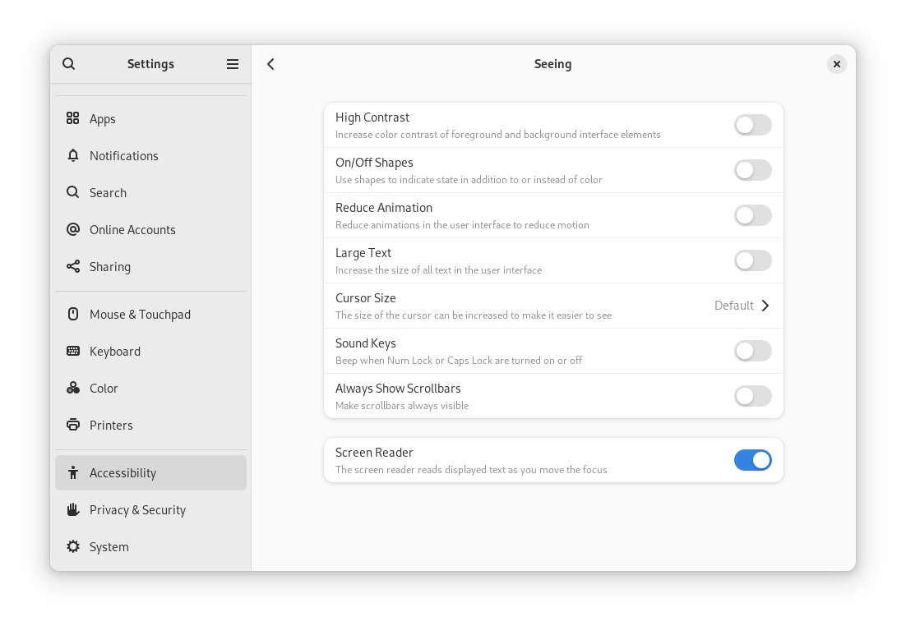
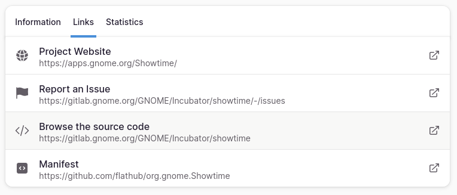

When you stop and think about it, user interfaces are almost entirely designed around sight: they display graphical elements that are mostly interacted with by pointing and clicking (or touching). However, as we know, not everyone has "perfect" vision: some are color blind, some are short sighted, some are long sighted, etc. In many cases, these people can still interact with the same user interfaces as everyone else, but those with more severe visual impairments need a different method to use their computers.

That's when the Screen Reader comes in! The Screen Reader is a software that adapts computers to the needs of users with low vision or blindness, by reading descriptions of user interfaces out loud and facilitating keyboard navigation.

Today, we will explore the web with Orca, the Screen Reader of the Linux Desktop! After that, we will contribute towards improving the experience of Orca users.

Mind you that Screen Readers have tons of advanced features to empower users with as much efficiency as possible. Because of that, it can be challenging to use this kind of software if you are not used to it. I invite you to embrace this challenge as an opportunity to experience the desktop from a different perspective, and to appreciate the way other people user their computers.

Without further ado, let's get going!

# Part I - Exploring the Screen Reader

## Enabling and Disabling Orca

You can enable and disable Orca by pressing `Super` + `Alt` + `s`. This can also be configured via GNOME Settings, under "Accessibility" > "Seeing" > "Screen Reader".



Turn up and the volume and make sure you hear a robotic voice saying "Screen Reader on" and "Screen Reader off". Then, open the Firefox web browser and check if Orca describes the current open tab. If it is quiet, try closing and re-opening Firefox again or disabling and re-enabling Orca.

## Controlling Orca

Orca is controlled entirely from the keyboard, having dozens of shortcuts. Besides, these keyboard shortcuts are slightly different if you have a Number Pad (NumPad) or not. I have laid out the most important ones below, but an exhaustive list can be found in the quite excellent [Orca documentation](https://help.gnome.org/users/orca/stable/index.html.en).

### Orca Modifier

| Key             | Without a NumPad (Laptop) | With a NumPad (Desktop) |
| --------------- | ------------------------- | ----------------------- |
| `Orca Modifier` | `Caps Lock`               | `NumPad Ins`            |

### Important shortcuts

| Action                       | Without a NumPad        | With a NumPad             |
| ---------------------------- | ----------------------- | ------------------------- |
| Toggle screen reader         | `Super` + `Alt` + `s`   | `Super` + `Alt` + `s`     |
| Interrupt screen reading     | `Orca Modifier` (press) | `Orca Modifier` (press)   |
| Toggle caret mode in Firefox | `F7`                    | `F7`                      |
| Where am I                   | `NumPad Enter`          | `Orca Modifier` + `Enter` |
| Display page structure       | `Alt` + `Shift` + `h`   | `Alt` + `Shift` + `h`     |
| Display page buttons         | `Alt` + `Shift` + `b`   | `Alt` + `Shift` + `b`     |
| Read current line            | `NumPad 8`              | `Orca Modifier` + `i`     |
| Read current word            | `NumPad 5`              | `Orca Modifier` + `k`     |
| Read onward                  | `NumPad +`              | `Orca Modifier` + `;`     |
| Next link                    | `k`                     | `k`                       |
| Previous link                | `Shift` + `k`           | `Shift` + `k`             |
| Next paragraph               | `p`                     | `p`                       |
| Previous paragraph           | `Shift` + `p`           | `Shift` + `p`             |
| Next button                  | `p`                     | `p`                       |
| Previous paragraph           | `Shift` + `p`           | `Shift` + `p`             |

## Activity: Exploring the web with Orca

Open the Firefox web browser and head to https://flathub.org. Find an app that looks interesting to you and explore its page using Orca. Try to navigate the entire page!

Feel free to use the questions below as a guide to your exploration:

1. Can you read the app description? Try to do it twice.
2. Can you click the "Install" button? What happens when you do?
3. Can you figure out if the app is verified or not? How so?
4. Can you guess what the screenshots of the app are showing?
5. Can you find the link to the source code of the app?

# Part II - Captioning Screenshots in Flathub

## Flatpak and Flathub

Flatpak is a modern packaging technology, which aims to work on all Linux distributions. In turn, Flathub is an app store for software that was packaged using Flatpak. Flathub has been embraced as the main channel for publishing applications by many projects, most notably GNOME!

## App listings

Each app that is published on Flathub has a page for itself, which is called "app listing". You will find lots of important information about an app on its listing, such as:

- Name
- Description
- Author
- License
- Permissions
- Screenshots

All this information is sourced from a special file called "MetaInfo File", that is typically hosted on the app's repository. Its filename usually ends with `.metainfo.xml.in.in`. You can click [here](https://github.com/SeaDve/Kooha/blob/main/data/io.github.seadve.Kooha.metainfo.xml.in.in) to see an example of a MetaInfo File. You can read more about this file format on Flathub's [MetaInfo Guidelines](https://docs.flathub.org/docs/for-app-authors/metainfo-guidelines/).

## Screenshot captions

To promote high-quality listings, Flathub publishes its own [Quality Guidelines.](https://docs.flathub.org/docs/for-app-authors/metainfo-guidelines/quality-guidelines/). These guidelines encourage maintainer's to add captions to their images, which, as we learned in the first activity, helps people who use Screen Readers understand the content of the screenshots of the app. To quote the Quality Guidelines:

> Every screenshot should have a caption briefly describing it. Captions should only be one sentence and not end with a full stop. Don't start them with a number.

To be more precise, good captions should clearly convey the functionality demonstrated in the screenshot, as well as give a general idea of the user interface on display. I have cataloged dozens of Flathub listings on this Google Sheet:

[GUADEC 2024 - Accessibility Hackathon](https://docs.google.com/spreadsheets/d/1QA7_7xVPh83buAlABcd1qKZeljmDgkuRErwFqiJY5cY/edit?gid=0#gid=0)

There you find listings with **Caption status** set "Exemplary", which are great models of how captions should be written.

## Activity: Contributing with captions

Now, we will improve the accessibility of the Linux Desktop (albeit slightly), by contributing to Flathub with screenshot captioning. To do that, follow the instructions laid out below:

1. Open the Google Sheet on [this link](https://docs.google.com/spreadsheets/d/1QA7_7xVPh83buAlABcd1qKZeljmDgkuRErwFqiJY5cY/edit?usp=sharing)
2. Choose an app with **Caption status** set "Absent"
3. Assign "In-progress" to its **Caption status**
4. Put your name(s) on its **Group** column
5. Head to the Flathub listing link of the app
6. Find the repository of the app (usually under "Browser the source code" on "Links")
   
7. Log in or create an account on the platform that hosts the repository of the app (GitHub, GitLab, etc)
8. Go back to the repository of the app, and find its MetaInfo File. It is typically placed in a `data/` directory, at the root of the repository.
9. On the MetaInfo File, look for the `screenshot` tags and find the files referenced in it
10. Inside each `screenshot` element, there is an `image` element. For each of those, create a new line with `caption` tags. The caption goes in between them, like so:

```diff
<screenshot>
	<image>https://raw.githubusercontent.com/SeaDve/Kooha/main/data/screenshots/screenshot2.png</image>
+     <caption>In-progress recording duration and button to stop recording</caption>
</screenshot>    
```

11. When you are done writing your captions, proof read them and run them through a spellchecker. I haven't found any great ones online, but [Language Tool's](https://languagetool.org/) is passable.
12. Commit your changes, following the commit message conventions of the project you are contributing to. If this convention is not documented anywhere, try to infer it looking at the commit history.
13. Open a Pull Request (PR) / Merge Request (MR) with your contribution, explaining what you did and why it is important. You can use [my explanation](https://github.com/SeaDve/Kooha/pull/307) as a model.
14. Put a link to your PR/MR on the sheet.
15. Wait for the maintainer's feedback

# Part III: Farewell

Thank you for attending this workshop. I hope you had a good time!

Until the next one!
