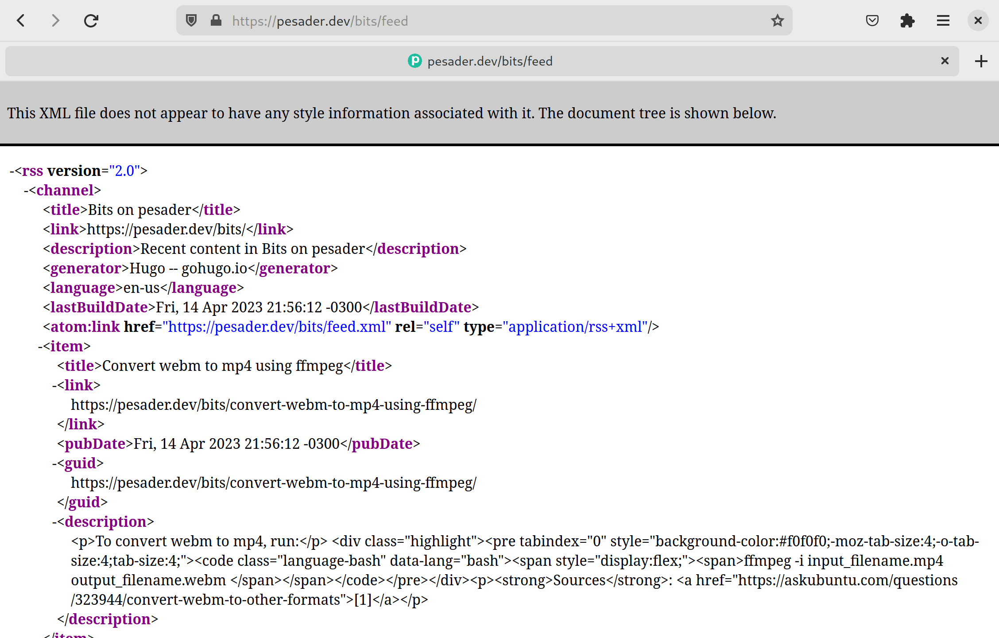
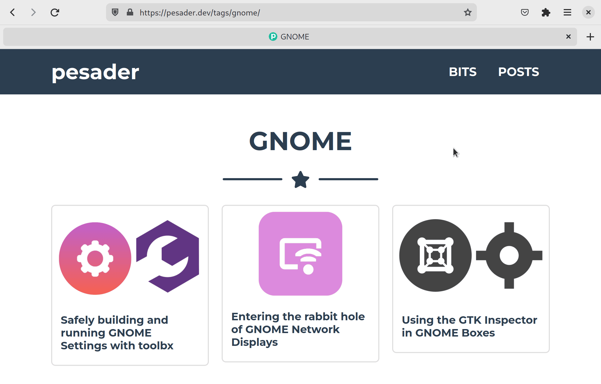
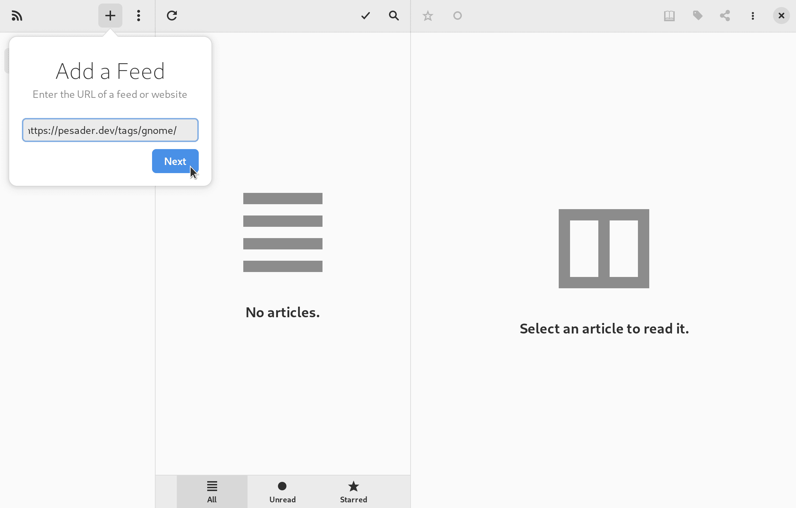
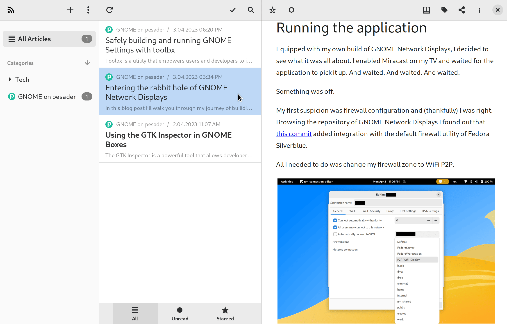

I recently got news that I was accepted as a Google Summer of Code (GSoC)
contributor for the GNOME Project! I'll work on integrating the functionality
of GNOME Network Displays into GNOME Settings, and I'll be reporting my
progress publicly in this blog.

Before the contribution period starts, there's a month-long Community Bonding
Period. On GNOME, GSoC interns are asked to add an RSS feed of their blogs to
[Planet GNOME](https://planet.gnome.org). For that purpose, I'll show in this
post how I added and configured an RSS feed for my Hugo-powered blog.

You are welcome to use my website's theme if you want a blog with the same
looks and functionality, but you can also uso this as a guide for implementing
an RSS feed on your theme. Either way, I'll assume you have a working Hugo
theme you can build from as some knowledge about Hugo (taxonomies, page
variables, `config.toml` options, etc).


## 1. Reference the RSS feed in `<head>`

Thankfully, Hugo has built-in support for RSS feeds! The first thing you need
to do to use this feature in adding a reference to the RSS output format on
the `<head>` tag of your blog, like so:


```html
{{ with .OutputFormats.Get "RSS" -}}
{{ printf `<link rel="%s" type="%s" href="%s" title="%s">` .Rel .MediaType.Type .RelPermalink $.Site.Title | safeHTML }}
{{- end }}
```

It is a best-practice to define this tag in a file that you use as a base for all
other files in your website (I do it in the [`baseof.html`](https://github.com/pesader/hugo-bootstrap-freelancer-template/blob/ceb6e7c0f7f543f1d705fd5218bcda8122973bbe/layouts/_default/baseof.html#L11-L13)
file).

## 2. Configure a baseName in `config.toml`

You should now add the following to the `config.toml` file of your website:

```toml
[outputFormats]
[outputFormats.RSS]
    mediaType = "application/rss+xml"
    baseName = "feed"
```

If you push these changes, you will have an RSS feed for any taxonomy (tags,
categories, authors, etc) of your blog! To get the RSS `.xml` file, head over
to the taxonomy list and append "`/feed`" to it. Take a look:



## 3. Override the default RSS template

You may find that the content of the RSS feed isn't exactly what you hoped for.
By default, Hugo only includes a summary (the first paragraph) in the feeds,
but you probably the whole thing to be included in [Planet GNOME](https://planet.gnome.org)!
To fix that, you'll need to write a custom `rss.xml` template. Luckly, you
won't have to start from the ground-up -- let's just copy Hugo's default and
start from there.

First, copy the contents of [this file](https://github.com/gohugoio/hugo/blob/master/tpl/tplimpl/embedded/templates/_default/rss.xml)
to `layouts/_default/rss.xml`. Then do the following change:

```diff
- <description>{{ .Summary | html }}</description>
+ <description>{{ .Content | html }}</description>
```

If you want to include only one section of content in your RSS feed, now's the
time to do that too. For instance, to include only "posts" you may do the
following change:

```diff
- {{- if or $.IsHome $.IsSection -}}
- {{- $pages = $pctx.RegularPages  -}}
- {{- else -}}
- {{- $pages = $pctx.Pages  -}}
- {{- end -}}
+ {{- if or $.IsHome $.IsSection -}}
+ {{- $pages = (where (where $pctx.RegularPages ".Section" "posts") "Kind" "page")  -}}
+ {{- else -}}
+ {{- $pages = (where (where $pctx.Pages ".Section" "posts") "Kind" "page")  -}}
+ {{- end -}}
```

You can checkout the `rss.xml` for my website [here](https://github.com/pesader/hugo-bootstrap-freelancer-template/blob/ceb6e7c0f7f543f1d705fd5218bcda8122973bbe/layouts/_default/rss.xml).

## 4. Add custom markdown render hook

If you inspect the `.xml` file generated by Hugo at this point, it is possible
that the paths for markdown images are wrong. This happens because it is common
to use relative paths for including images in markdown, but the RSS feed
doesn't factor that in by default.

Gladly, Hugo allows tweaking the conversion of markdown to html with [Markdown
Render Hooks](https://gohugo.io/templates/render-hooks/), which can be used to
convert relative paths to absolute paths. If you store all images related to a
blog post in its dedicated directory (like I do), all you need to do is create
a file named `render-image.rss.xml` under the `/layouts/_default/_markup/`
directory and fill it with:

```html
<p class="md__image">
  
</p>
```

You can checkout the `render-image.rss.xml` for my website [here](https://github.com/pesader/hugo-bootstrap-freelancer-template/blob/ceb6e7c0f7f543f1d705fd5218bcda8122973bbe/layouts/_default/_markup/render-image.rss.xml).

## 5. Test the feed in an aggregator

You're done! I recommend you try adding your blog to an RSS feed
reader/aggregator, so you can make sure it works as intended. I like using
[NewsFlash](https://flathub.org/apps/com.gitlab.newsflash) for this, so here's
how you can do it there.

First, find the page in your blog that lists the content that you want to add
to the feed. In my case, I want all posts tagged with GNOME to be included in
Planet GNOME, so the link to the page that lists those is [`https://pesader.dev/tags/gnome`](https://pesader.dev/tags/gnome/):



Copy that link and add it to NewsFlash (appending `/feed` is optional):



And make sure it's working (especially the images!):



That's all for today, hope you learned something useful!

## Sources

- [Justin James: Create RSS Feed for Site](https://digitaldrummerj.me/hugo-create-rss-feed/)
- [Hugo Documentation: RSS templates](https://gohugo.io/templates/rss/)
- [Hugo Documentation: Markdown Render Hooks](https://gohugo.io/templates/render-hooks/)
- [Hugo Discourse: string concatenation to build path for partial](https://discourse.gohugo.io/t/string-variable-concatenation-to-build-path-for-partial/701/3)
