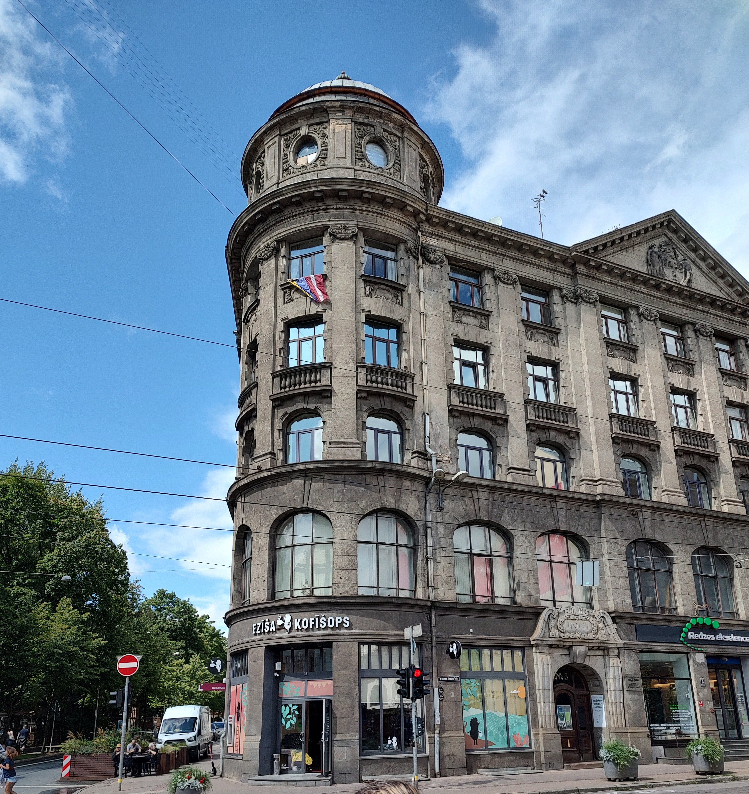

A few days back, I went for the first time to the GNOME Users and Developers Everywhere Conference (GUADEC). Even though I'm just a Google Summer of Code intern, the GNOME Foundation was kind enough to sponsor my trip to Riga, Latvia, where the event took place this year.

# The city

After an 18h trip to Riga, I thought I would collapse on my hotel's bed as soon as I stepped into my room. However, I was so incredibly overwhelmed by Riga's unique beauty that I dropped all my stuff in the hotel as fast as I could, then left for a quick stroll.

My first destination ended up being the Saint Peter's Chapel, and for good reason! It is the tallest building in the city and, since Riga is extraordinarily flat, you can see everything from up there. I arrived a few days before the conference but hadn't made any plans, so I took the opportunity of the bird's-eye-view to scan the whole city for interesting places to visit.

Here's the problem: everything looks interesting in Riga. Take this building for example:

This beautiful, intricately detailed Art Noveau building would be a tourist attraction on its own was it placed on the streets of my motherland. If you take a closer look, you will realize that the sign on it reads "Eliza Kofisops". "Kofisops"? Yeah, that's right, this amazing building is nothing but an ordinary every-day-life coffee shop!

In spite of the choice paralysis, I ended up visiting lots of places. Some of the highlights were the Occupation Museum, the Fashion Museum, the National Library, and the suburbs waking tour.

# The conference

Time flew as I was touristing through Riga and, before I knew, GUADEC 2023 was upon me!

## The presentations

One of the best parts of attending GUADEC was seeing the impressive amount of ongoing work. Usually, the news only cover features and enhancements that are *ready*, so it was very exciting to get a glimpse of what the future holds for GNOME.

That is especially true of the work being done by the GNOME Design Team and GNOME Foundation. For that reason, some of my favorite talks were "GNOME Design: State of the Union" by the Design Team, and "Beyond the Code: Another side of GNOME" by Melissa Wu.

I also had a legit fun time with some of the lightning talks. Jussi Pakkanen’s analogy between geomtry problems and preferences was nothing short of brilliant and Tobias Bernard's surprise lighting talk on GNOME's logo was a bold hot take on branding.

If I were to cite every other talk I enjoyed I would probably end up listing the entire schedule of the conference so let's just stick with this subset 😅.

## The contributions

At my very first GUADEC I already had the honor to present a few things! It was a bit unnerving to speak in front of such a distinguished audience, but the excitement prevailed over every other feeling.

On the second day, I presented a Lightning Talk on ["How to make a FOSS contribution event"](https://www.youtube.com/watch?v=qaZuQO0bK-M&t=22926s) in which I talked about the work I do at LKCAMP, the FOSS student club that I participate in.

On the third day, I presented yet another Lightning Talk. This time I spoke about my work as a Google Summmer of Code intern, on ["Integrating the functionality of GNOME Network Displays into GNOME Shell"](https://www.youtube.com/watch?v=hv-bkYpHSbQ&t=22765s).

Finally, in the last day, I held a workshop for first time contributors. Most attendees, however, were not anywhere near "first time contributors". For that reason, I ended up changing up the structure of the event a bit and focus a bit more on my method (or rather, LKCAMP's method) for making events to enlist new contributors to open source.

# The afterword

Again, I would like to express my gratitude towards the GNOME Foundation for making this trip possible. I had an amazing time getting meeting the faces behind the usernames that I had been interacting with for years, and none of that would have been possible without the Foundation's support.

More speficially, I would to thank Melissa Wu for patiently and diligently answering all my questions regarding the trip and Asmit Malakannawar for providing me with the documents (e.g. invitation letter) needed to facilitate my immigration into Latvia.

Hope to see you again in Denver for GUADEC 2024!

