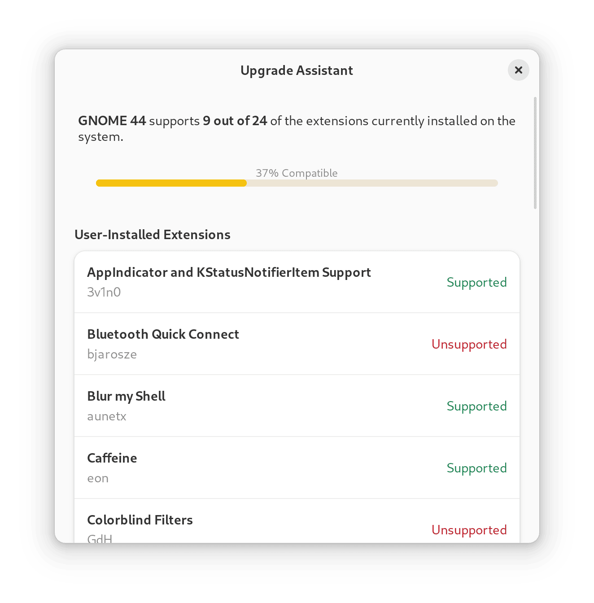

I absolutely love extensions, in general. I remember being blown away every
time I found a notably extensible software, from Firefox add-ons in my early
days of surfing the web to Neovim plugins in my latest coding endeavors.

This is why, once I started using GNU/Linux, I was amazed by GNOME Shell
extensions. Being able to customize the appearance and behavior of my desktop
environment as easily as used to with VS Code extensions was unimaginable
coming from Windows and I loved every bit of it.

Since then, I've been a GNOME Shell extension fanatic and only upgraded my
workstation when all extensions were made compatible with the latest version of
GNOME. The addition of an upgrade assistant to Extension Manager made the wait
easier, though not shorter.




Now that my current distro of choice (Fedora Silverblue) allows upgrading early
and safely, I decided to do something different: upgrade right away and
contribute to the extensions with GNOME 44 support!

These were the extensions I chose to contribute with:

## [**ddterm**](https://extensions.gnome.org/extension/3780/ddterm/)

   A drop down terminal extension for GNOME Shell. With tabs. Works on
   Wayland natively. I use it every day as my music player, with `ncspot`.

## [**Focus changer**](https://extensions.gnome.org/extension/4627/focus-changer/)

   Change focus between windows in all directions, using vim-like mappings
   (`Super` + `h`, `j`, `k`, `l`). Can't beat that muscle memory!

## [**Focused Window dbus**](https://extensions.gnome.org/extension/5592/focused-window-d-bus/)

   Exposes a dbus method to get active window title and class. Required to get
   ActivityWatch working on mutter.

## [**Reading Strip**](https://extensions.gnome.org/extension/4419/reading-strip/)

   Works as a reading guide for computer and this is really useful for people
   affected by dyslexia. Useful to avoid mixing up table rows and columns!

Here's how that experiment went.

# Upgrading to GNOME 44

As I said, version upgrades are safe and easy on Fedora Silverblue! All I had
to do was pin my current deployment with:

```bash
sudo ostree admin pin 0
```

Then rebase to latest Fedora release:

```bash
rpm-ostree rebase fedora:fedora/38/x86_64/silverblue
```

# Locating extension directories

With GNOME 44 installed on my machine, it was time to locate where the GNOME
Shell extensions were installed. Extensions installed via EGO or Extension
Manager are located at `$HOME/.local/share/gnome-shell/extensions`.

Each extension has a dedicated folder, whose name looks like
`extension-name@author.example.com`.

# Editing the `metadata.json` file

On each of these directories there's a `metadata.json`, that includes a list
called "`shell-version`" with the versions of GNOME supported by the extension.
My first test was to simply add "`44`" to that list and see what happened, like
so:

```diff
  "shell-version": [
    "40",
    "41",
    "42",
-   "43"
+   "43",
+   "44"
  ],
```

# Restarting the session

Wayland requires logging out to restart the session, so I logged out and logged
in again.

# Tweaking, if needed

To my surprise, three out of four extensions worked by simply changing the
`metadata.json` file!

The **Focused Window dbus** extension loaded properly, but when I tried to
actually call its dbus method I got an error saying that the `canshade`
window property didn't exist. Since that didn't seem essential for the
extension's funcionality I removed the code related to that and tried
again. This time, it worked perfectly!

# Contributing

After using the extensions on GNOME 44 for a few days without any issues I
decided to contribute to them. Some extensions a specific commit tag for
changes made to `metadata.json`, so I made sure to use them in my
contributions.

I think this a simple but valuable contribution, making it an excellent gateway
into contributing to GNOME Extensions and FOSS projects in general. Give it a
shot! 🧩❤️
