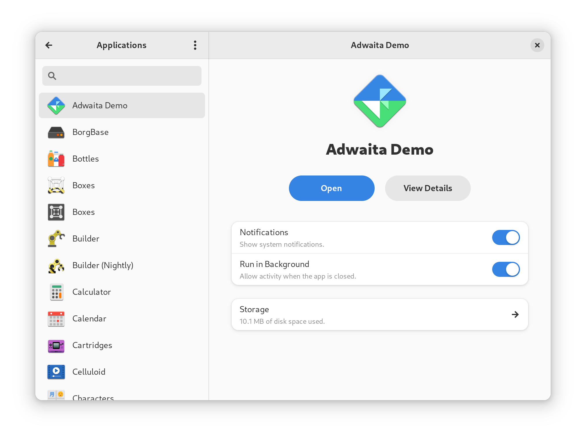
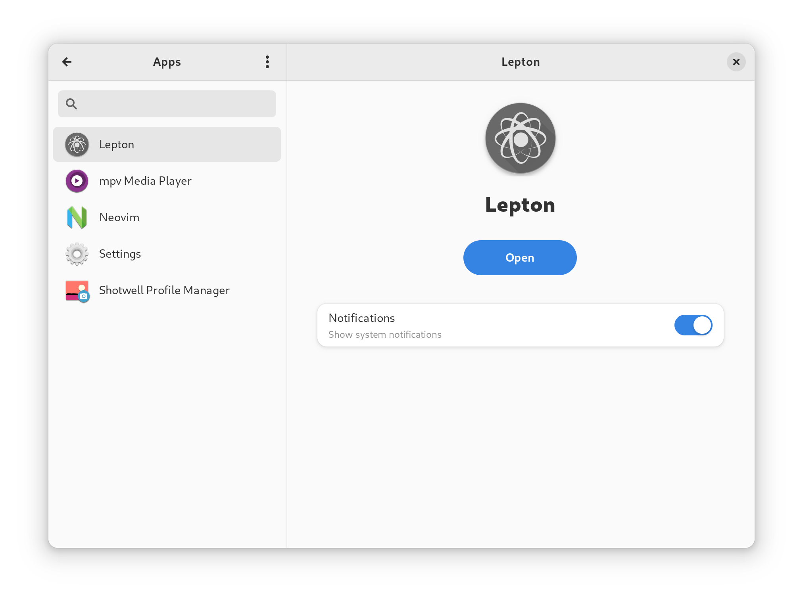

Toolbx is a utility that empowers users and developers to install software on
isolated environments, drastically reducing the risk of compromising the
stability of their operating system. It is also indispensable for users of
immutable distros (e.g. Fedora Silverblue, Endless OS, Vanilla OS, etc) like
myself.

On this blog post I'll share how I used toolbx to safely build and run GNOME
Settings.

# Step 0: backup all your settings

The isolation provided by toolbx only applies to system directories (those
that you need `sudo` to make changes to). That means your `$HOME` directory is
as vulnerable to mishaps as it is outside of the toolbx!

Since your preferences are stored within your `$HOME` directory make sure you
back them up before meddling with an unstable version of the GNOME Settings
app. To make the backup run:

```bash
dconf dump / > $HOME/preferences_backup.ini
```

Again, since your `$HOME` directory is not safer inside a toolbx, move that
file somewhere else (e.g. a USB stick, a trusted cloud storage provider, etc).
To restore the backup file, move it back to your `$HOME` directory and run:

```bash
dconf load -f / < $HOME/preferences_backup.ini
```

# Step 1: choose the right toolbx image

To choose the operating system that will run on our toolbx, you need to pick
its base image. To figure that out, take a look at the `.gitlab-ci.yml`:

```yml
.fedora.container.common:
  # ...
  tags: [ crun ]
  variables:
    # ...
    FDO_DISTRIBUTION_TAG: '2023-03-14.0-main'
    FDO_DISTRIBUTION_VERSION: rawhide
```

Looks like GNOME Settings is targetting Fedora Rawhide, which is a rolling
build of Fedora that has the purpose of testing software for upcoming releases.
That said, you can create your toolbx with the following command:

```bash
toolbox create gnome-control-center --image registry.fedoraproject.org/fedora-toolbox:rawhide
```

If you are doing this for the first time, this command will download the Fedora
Rawhide toolbx image. It will take some time and some storage (500Mb) but don't
worry it'll be worth it! Once the toolbx is created, enter it with:

```bash
toolbox enter gnome-control-center
```

# Step 2: installing dependencies

To install the dependencies needed to build GNOME Settings, simply run:

```bash
sudo dnf builddep gnome-control-center
```

# Step 3: building and running

Finally, head to the root of its repository and run:

```bash
make _build && ninja -C _build
```

This will build GNOME Settings at `./_build/shell/gnome-control-center`.

# Step 4: taking advantage of the isolation

To run the executable file, you can leave the toolbx and execute like so:

```bash
exit
./_build/shell/gnome-control-center
```

However, you may want to run it inside your toolbx! If that's the case, you
also have to install your local build of GNOME Settings. To do that, run:

```bash
ninja -C _build install
```

This will allow you to take advantage of the isolated environment provided by
toolbx! For instance, when was writing [this
contribution](https://gitlab.gnome.org/GNOME/gnome-control-center/-/merge_requests/1759)
to the applications panel, I wanted to test a few apps that I didn't have
(nor wanted to have) installed on my system. To address that, I installed a few
applications inside my development toolbx! As you can see, the Settings app
lists different applications when I open it from inside or from outside of the
toolbx:

| Outside toolbx | Inside toolbx |
|-|-|
|  |  |

That's all! Hope this was useful for you!


# Credit

This post is a personal take on the GNOME Settings' own
[guide](https://gitlab.gnome.org/GNOME/gnome-control-center/-/wikis/Building-GNOME-Settings-in-a-Toolbx)
on building with toolbx.
