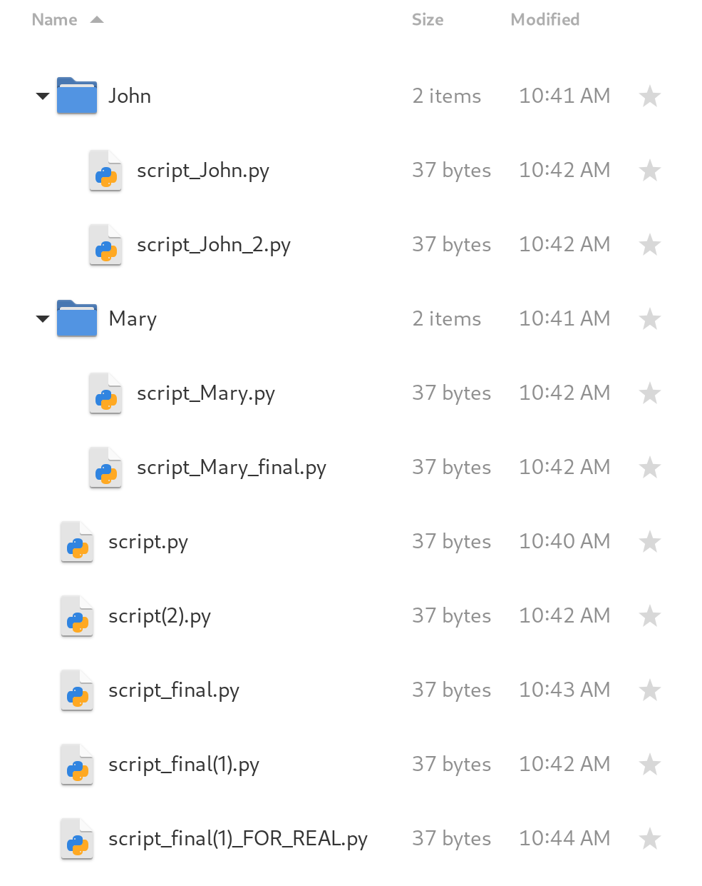

## Explaining git concepts

### The problem



If you've ever worked on a coding project, chances are you felt like making a copy of your work at some point. For example, you may want to rewrite part of your project without running the risk of permanently losing what you already wrote. That's when you head over to your file manager and make a copy of the work you've done so far, so you can safely rollback to it if the rewrite turns out badly.

Even more copies will surface if you are working on a group, as members send copies of their work back and forth until a poor soul is made reponsible for manually consolidating all copies into a single cohesive program (most likely another copy!). Sooner or later, you end up with a mess that looks like this image on the right.

At that point, you may ask yourself: isn't there a better way to do this? And, gladly, the answer is yes!

### The solution

The "better way" is using a version control system (VCS) and `git` is the golden standard when it comes to this. Granted, "version control system" is an intimidating name, but it's nothing more than a helper for creating, managing, and consolidating copies of the work that you (and possibly other people) did. You can think of those copies as versions of your work, so, from now, on I'll refer to them as "versions" instead of "copies".

A piece of work whose versions are managed by `git` is called a repository (or a "repo" for short). To be more specific, `git` keeps watch over the entire directory where your project files are, so make sure you store all relevant files in a dedicated directory (not the "Downloads" directory, please!).

For demonstration purposes, I'll show how to use `git` on a project that you are starting from scratch. Do know, though, that it *is* possible to start using `git` midway through a project, following pretty much the same workflow as the one I'll demonstrate.

### The demonstration

Suppose you want to use `git` to manage versions of a single initially empty file named CONTRIBUTORS.md, on which the names of all the people who made changes to it will be written. While this may seem completely useless (as it could have been, since this is just a demonstration), many real-life projects use a file like that for giving credit to its collaborators, so it's not that far of a stretch!

Remember what I said before: `git` keep watch over an entire directory. Since we only want to manage versions of a single file, that file needs to be put in a directory just for itself. That means the structure of our repository will look like this:


To start using `git`, open a terminal and navigate to the directory pictured above. When you get there, run the following command to let `git` know that you want to do version control on your current directory:

```bash
$ git init
Initialized empty Git repository in /path/to/repository_directory/.git/
```

Congratulations, you just made your first `git` repository! You can get a general idea its state by running the following command, which I guarantee will soon become a habit of yours:

```bash
$ git status
On branch main

No commits yet

Untracked files:
  (use "git add <file>..." to include in what will be committed)
	CONTRIBUTORS.md

nothing added to commit but untracked files present (use "git add" to track)
```

As you can see CONTRIBUTORS.md is "untracked". That means `git` is aware of the existence of the file but isn't actively keeping track of the changes that are made to it. Now we need to explicitly tell `git` that we want CONTRIBUTORS.md to be tracked.

To do that, let's follow the advice given by `git status` and `use "git add" to track`:

```bash
$ git add CONTRIBUTORS.md
```

The `git add` command puts files in the "staging area". The purpose of the "staging area" is to serve as an intermediary state, where you gather all the files you want apply a certain `git` operation to. The "staging area" is like a launchpad, from which many different things can be done (e.g. saving changes for later, undoing changes, etc).

Your most common way out of the "staging area" will be creating a new version from the changes you put there (represented in the center of the figure above). Let's do that on our own "staging area", which currently contains our beloved (and still empty) CONTRIBUTORS.md file, by running:

```bash
git commit
```

This will open a simple text editor in your terminal, where you'll write a description of the version you are creating. The name of this description is "commit message". The first line of the commit message summarizes (at most 80 characters) why you made the changes which were included in the new version. All lines below it can be used for a more detailed explanation of your changes.

Since this is our first version, the summary can be as simple as "`first commit`" and no additional explanation is needed. The file has now entered the "committed" state, which means you have created a new version of it! To help with visualization I'll represent this version with a circle, a miniature of the CONTRIBUTORS.md file, and the first line of the commit message like so:

<br>

<p></p>

When we make changes to files that have been at least once committed, they will enter the "modified" state. You can see that for yourself if you add your own name to CONTRIBUTORS.md and run `git status`:

```bash
$ git status
On branch main
Changes not staged for commit:
  (use "git add <file>..." to update what will be committed)
  (use "git restore <file>..." to discard changes in working directory)
	modified:   CONTRIBUTORS.md

no changes added to commit (use "git add" and/or "git commit -a")
```

Since our last commit was really boring, let's take the opportunity to write a more interesting one! Add your CONTRIBUTORS.md to the "staging area" with `git add` and create a new version with `git commit`. The commit message summary can be something like "add the name of the maintainer". `git` stores these versions *sequentially*, in a timeline called "branch". Here is how our branch looks with our latest commit:

<br>

<p></p>

One of the most powerful features of `git` is the ability to manage multiple branches (i.e. timelines) of the same repository! That grants you the possibility to create new versions of your project in an isolated environment, allowing you to experiment without running the risk of breaking your main branch. It is important to notice that branches always have names -- the main branch is usually named "main" or "master", while other branches may be named with anything descriptive label that you pick.

For an example of our own, let's create and enter a new branch with:

```bash
git checkout -b add-group-members
```

As you may have guessed from the descriptive name that I suggested, we'll use this branch to add the names of our fictional group members (John and Mary) to CONTRIBUTORS.md. When that's done let's create a new version of our project with the usual "`git add`→`git commit`" workflow.

Another good thing about branching is that work can be done in parallel much more easily. In our example, the same file was changed differently in the "add-group-members" branch (depicted in brown) and in the main branch (depicted in pink), like so:

<br>

<p></p>

As you can see, both branches made improvements to CONTRIBUTORS.md, so it's only natural that we would want to make a new version that somehow includes the two sets of changes. That's when `git merge` comes to rescue:

```bash
git checkout main
git merge add-group-members
```

This command will attempt to automatically consolidate the changes made in both branches. In our case, this will be possible because one of the branches only changed the first line of CONTRIBUTORS.md, while the other only added new lines. Automatic merging isn't always possible though, as we'll demonstrate further down the line.

What we end up with is this:

<br>

<p></p>

Now, there's one last thing I would like to explain. `git` is capable of fetching branches that are stored on other computers, which is great for collaborating with other people on software development. These computers are called "remotes".

A branch stored on a remote can, like any other branch, be changed in parallel with other branches. This means that branches with the same name might be different between your local repository and your remote repository, as shown in the illustration below (in the last commit):

<br>

<p></p>

If we now try to merge the main branch of the remote repository with our main branch of our local repository (the command for doing that is `git pull`), `git` won't be able to consolidate both changes automatically because both branches made different changes to the same part of the CONTRIBUTORS.md file (the fourth line). When that happens, we've reached a conflict that needs to solved manually.

<br>

<p></p>

In our case, solving the conflict isn't that hard. The best approach is clearly keeping the names of the professor and of the teaching assistant in the list, so once we do that we can tell `git` that we're done merging.

<br>

<p></p>

However, solving merge conflicts usually isn't that easy, especially when it comes to software development. My advice to you is to try and make use of `git`'s features (especially branches) in an effort to avoid running into merge conflicts.

I hope this was useful for you and I thank you for your attention! Happy gitting!
