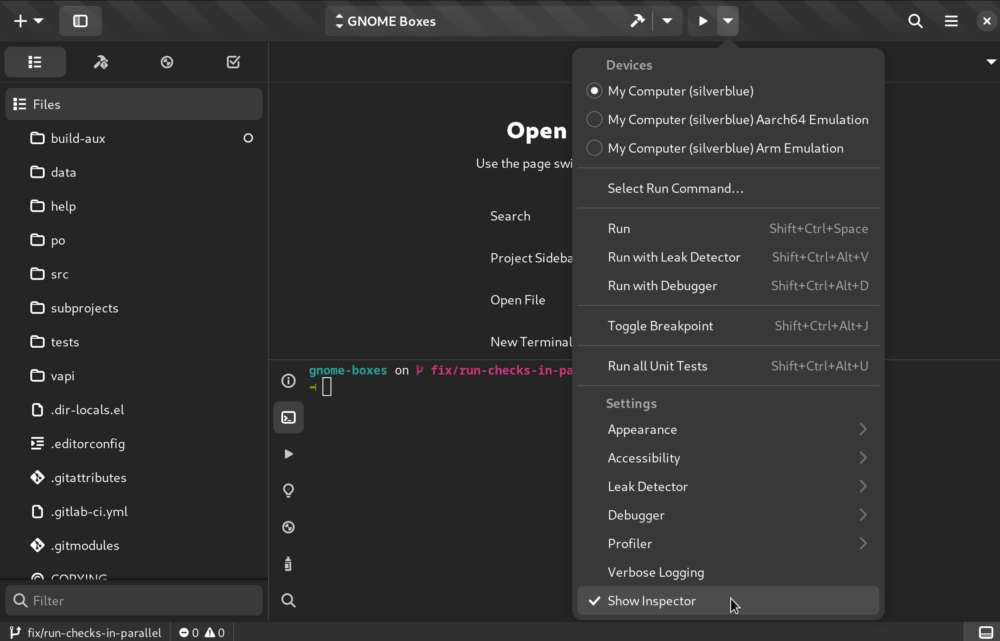
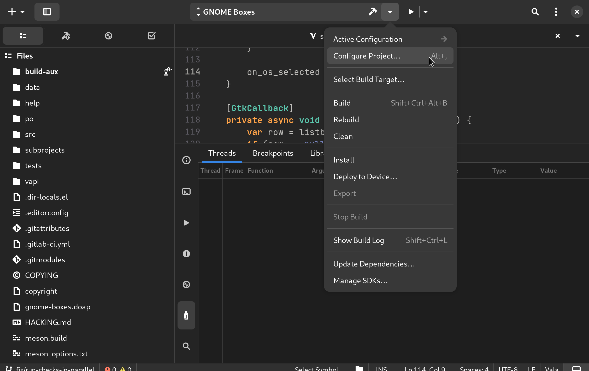
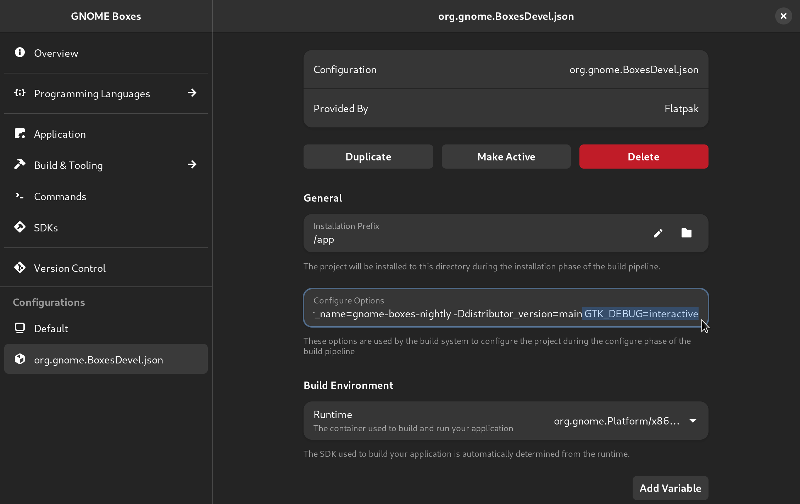
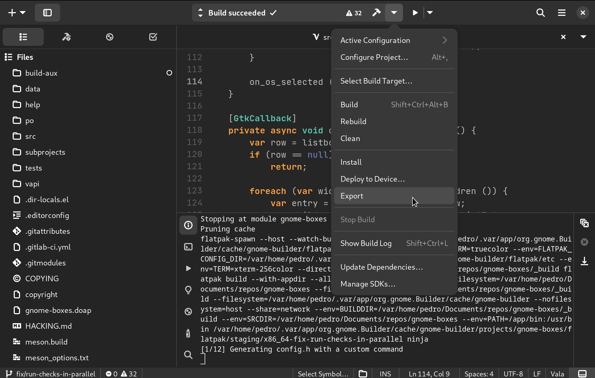
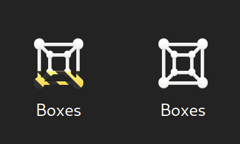

The GTK Inspector is a powerful tool that allows developers to better
understand how the code is "mapped" to the user interface of a GTK application.
It can usually be activated using the keyboard shortcut `Ctrl + Shift + i`, but
that isn't working on GNOME Boxes. Although I've made an
[attempt](https://gitlab.gnome.org/GNOME/gnome-boxes/-/merge_requests/577) to
fix this issue, changes to GNOME Boxes can a long time to land because it
follows the release schedule of GNOME (about once every six months).
Considering this, I've put together this guide to use the GTK Inspector in
GNOME Boxes in its current state.

# Method 1: enviroment variable

Setting the environment variable `GTK_DEBUG` to `interactive` upon launching
GNOME Boxes (or any GTK application!) will launch the GTK Inspector alongside
it.

If you installed Boxes using a package provided by your distribution run:

```bash
GTK_DEBUG=interactive gnome-boxes
```

If you installed GNOME Boxes as a flatpak, run:

```bash
GTK_DEBUG=interactive flatpak run org.gnome.Boxes
```
However, if you want to use the GTK Inspector with your own build of GNOME
Boxes, you should probably use one of the other methods below.

# Method 2: check option in Builder

On the most recent versions of GNOME Builder you can launch the inpector
alongside the application you are compiling by simply checking an option on the
run menu, as you can see below:



# Method 3: project configuration in Builder

If your version of GNOME Builder does not have the feature mentioned above yet,
don't worry there's still hope! First, head to the project configuration page
by hitting `Alt + ,` or clicking the "Configure Project..." option in the
dropdown menu of the omnibar:



Then, append `GTK_DEBUG=interactive` under the "Configure Options" text box:



What we did here was changing the flatpak manifest of GNOME Boxes using a nice
graphical user interface (thanks GNOME Builder!). Since you would want to keep
our changes to that file to yourself, you should tell `git` to ignore it. Using
`.gitignore` is no-go because the `.gitignore` file itself is being tracked by
`git`. Instead we should add the path of the flatpak manifest to
`.git/info/exclude`, so git will ignore it locally, like so:

```bash
echo "build-aux/flatpak/org.gnome.BoxesDevel.json" > .git/info/exclude
git update-index --assume-unchanged build-aux/flatpak/org.gnome.BoxesDevel.json 
```

Later, if you want to make a contribution that involves changing the flatpak
manifest, remove the line that contains `build-aux/flatpak/org.gnome.BoxesDevel.json`
from `.git/info/exclude` and run:

```bash
git update-index --no-assume-unchanged build-aux/flatpak/org.gnome.BoxesDevel.json 
```

# Method 4: export package in Builder

In case you need more flexibility with your custom build of Boxes (say,
scripting) you're better off exporting and installing a package. GNOME Builder
makes this very easy (thanks again GNOME Builder!). First, build the
application once by clicking the hammer in the omnibar. Then, click the "Export"
button and wait.



Once it's done, the file explorer will open in a directory with the exported
`.flatpak` package. Now, simply double-click it to install using GNOME
Software. When installation is complete, you'll be able to run it with:

```bash
flatpak run org.gnome.BoxesDevel
```

Or by heading to the Applications menu and selecting the icon that looks like
it's wrapped in "under construction" tape (on the left side of the image):



That about covers it! While I hope this blog post becomes obsolete when someone
fixes the issue of the keyboard shortcut not working (possibly myself?), I
also think this was a great opportunity to learn more about flatpak and GNOME
Builder.

See you in the next one!
